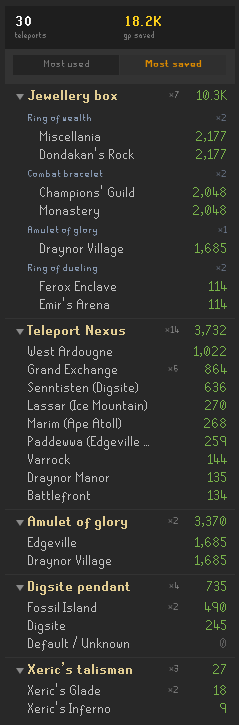

# PoH Teleport Counter

Counts the free teleports you take from your **Player-Owned House** — the Teleport Nexus,
jewellery box, and mounted amulets — and tallies the GP they save you, priced live from the
Grand Exchange.

## What it counts

| Transport | Coverage |
|---|---|
| **Teleport Nexus** | All 45 destinations — left-click, the teleport list, and the map |
| **Jewellery box** | Ring of dueling, games necklace, combat bracelet, skills necklace, amulet of glory, ring of wealth |
| **Mounted amulet of glory** | All 4 destinations |
| **Mounted Xeric's talisman** | Lookout, Glade, Inferno, Heart, Honour |
| **Mounted digsite pendant** | Digsite, Fossil Island, Lithkren |

A teleport is only tallied once you **actually teleport**. The plugin watches for the large
single-tick world-coordinate jump a teleport produces, so a cancelled Wilderness warning, a
denied teleport, or simply opening a menu never counts — and walking never trips it.

## GP saved

Savings are what the *same* teleport would have cost without the house: the runes for the
Nexus spell, or the fractional cost of a charged / consumed item (for example, a ruby
necklace plus the runes to enchant it for one digsite-pendant charge). Every price is the
live GE value, so the total tracks the market.

## The panel

- **Collapsible sections** — click a transport header to fold its rows away.
- **Sort** by *Most used* or *Most saved*.
- **Nested breakdown** — transport → item → destination, each row showing its use count
  (`×N`) and the GP it has saved. Long destination names are shortened with the full name on
  hover.

## Settings

- **Sort by** — order sections and rows by use count or by GP saved.
- **Count guest POHs** — also count teleports you make in another player's house. On by
  default; turn it off to count only your own home.

## Notes

- **Passive and read-only.** The plugin only reads your menu clicks and your position to
  recognise a teleport. It never sends input, automates anything, or modifies the game.
- Not affiliated with or endorsed by Jagex. RuneScape and Old School RuneScape are
  trademarks of Jagex Ltd.
